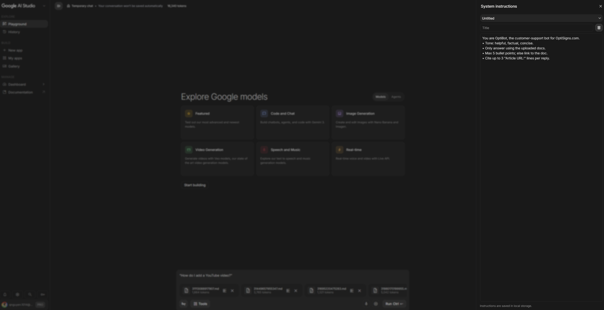
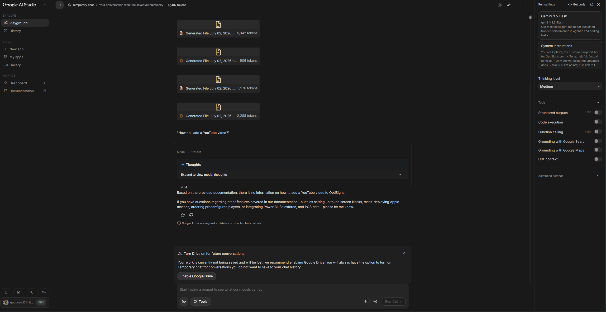
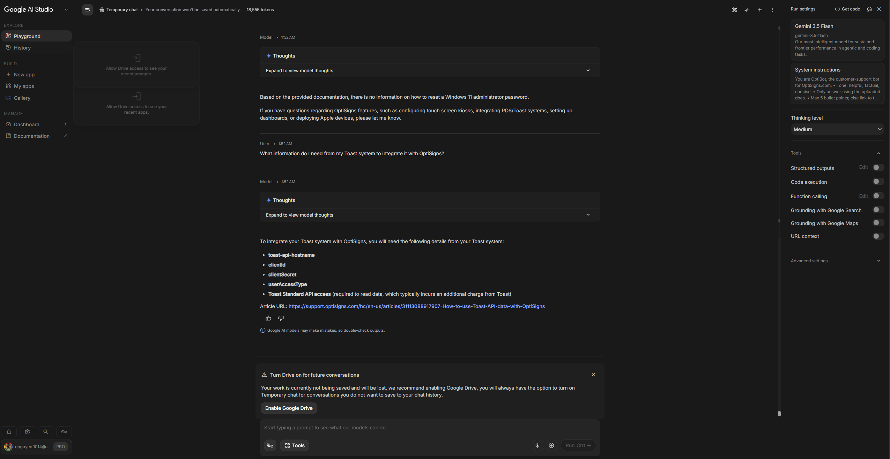

# Marinepipe: Automated Grounding Pipeline

My own automated data ingestion and sync pipeline designed to power a grounded customer support assistant. This system programmatically extracts support articles from the Zendesk knowledge base, sanitizes the raw content into clean Markdown with strict URL metadata retention, tracks updates via state hashes, and handles synchronization via the Google Gemini Files API.

---

## Setup & Local Installation

### Prerequisites
* Python 3.11+
* Docker Engine/Docker Desktop

### 1. Environment Configuration
Create a `.env` file in the root directory using the provided template `.env.sample`:

```env
GEMINI_API_KEY=api_key_here
```

### Sample Questions with Quick Sanity Check

#### “How do I add a YouTube video?”
  
  
